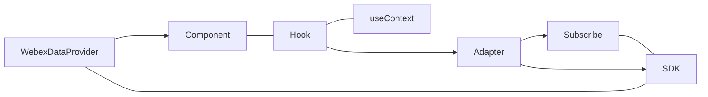
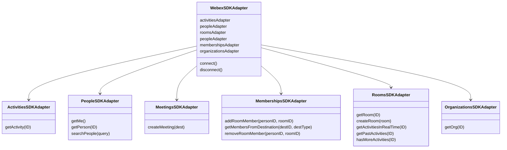
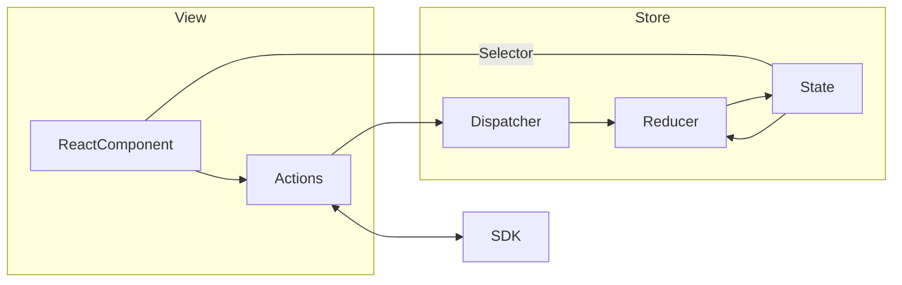

# 1. Widget Transitions Document

- [1. Widget Transitions Document](#1-widget-transitions-document)
  - [TLDR;](#tldr)
- [2. webex/components](#2-webexcomponents)
  - [2.1. Architecture Docs](#21-architecture-docs)
  - [2.2. Directory Structure](#22-directory-structure)
  - [2.3. Code Structure](#23-code-structure)
    - [2.3.1. Individual Components](#231-individual-components)
      - [2.3.1.1. Boilerplate](#2311-boilerplate)
      - [2.3.1.2. Storybook](#2312-storybook)
- [3. webex/sdk-component-adapters](#3-webexsdk-component-adapters)
  - [3.1. Architecture Docs](#31-architecture-docs)
  - [3.2. Directory Structure](#32-directory-structure)
  - [3.3. Code Structure](#33-code-structure)
    - [3.3.1. Individual Adapters](#331-individual-adapters)
- [4. webex/react-widgets](#4-webexreact-widgets)
  - [4.1. Architecture Docs](#41-architecture-docs)
  - [4.2. Directory Structure](#42-directory-structure)
  - [4.3. Code Structure](#43-code-structure)
    - [4.3.1. Individual Components](#431-individual-components)
      - [4.3.1.1. Space Widget](#4311-space-widget)
      - [4.3.1.2. Recent’s Widget](#4312-recents-widget)

## TLDR;

- components
  - Confluence
    - https://confluence-eng-gpk2.cisco.com/conf/display/WBXT/Webex+Components
  - GitHub
    - https://github.com/webex/components
  - NPM
    - https://www.npmjs.com/package/@webex/components
  - CI/CD
    - https://app.circleci.com/pipelines/github/webex/components?branch=master
  - Design Documents
    - Adaptive Card
      - https://confluence-eng-gpk2.cisco.com/conf/display/WBXT/Activity+Card+-+Component+Design
    - Messaging Widget
      - https://confluence-eng-gpk2.cisco.com/conf/display/WBXT/Messaging+Widget+-+Component+Design
    - Room Activities
      - https://confluence-eng-gpk2.cisco.com/conf/display/WBXT/Data+Structure+-+Room+Activity
- react-widgets
  - Confluence
    - https://confluence-eng-gpk2.cisco.com/conf/display/WBXT/Widgets?src=contextnavpagetreemode
  - GitHub
    - https://github.com/webex/react-widgets
  - NPM
    - Widget Spaces
      - https://www.npmjs.com/package/@webex/widget-space
    - Widget Recents
    - https://www.npmjs.com/package/@webex/widget-recents
  - CI/CD
    - https://app.circleci.com/pipelines/github/webex/react-widgets?branch=master
  - Deployment & CDN
    - https://code.s4d.io/widget-demo/alpha/index.html
    - https://code.s4d.io/widget-demo/production/index.html
- sdk-component-adapter
  - Confluence
    - TBD
  - GitHub
    - https://github.com/webex/sdk-component-adapter
  - NPM
    - https://www.npmjs.com/package/@webex/sdk-component-adapter
  - CI/CD
    - https://app.circleci.com/pipelines/github/webex/sdk-component-adapter
- component-adapter-interfaces
  - Confluence
    - TBD
  - GitHub
    - https://github.com/webex/component-adapter-interfaces
  - NPM
    - https://www.npmjs.com/package/@webex/component-adapter-interfaces
  - CI/CD
    - https://app.circleci.com/pipelines/github/webex/component-adapter-interfaces

# 2. webex/components
The Webex Components is a set of resources aimed at web developers that want to integrate Webex into their applications.

[](https://app.circleci.com/pipelines/github/webex/components) [](https://github.com/webex/components) []([url](https://www.npmjs.com/package/@webex/components))


> Confluence: https://confluence-eng-gpk2.cisco.com/conf/display/WBXT/Webex+Components

The component system is composed of:

- Data adapters `webex/sdk-component-adapters`
- Components `webex/components`
- Widgets `webex/widgets`


## 2.1. Architecture Docs
The following design documents are available for the components are as follows:

- Components
  - Adaptive Card
    - https://confluence-eng-gpk2.cisco.com/conf/display/WBXT/Activity+Card+-+Component+Design
  - Messaging Widget
    - https://confluence-eng-gpk2.cisco.com/conf/display/WBXT/Messaging+Widget+-+Component+Design


## 2.2. Directory Structure

The following is the directory structure of the component library:

```
src
├── adapters   <-- Contains JSON adapters that follow sdk-component-adapter-inferfaces
├── assets     <-- Contains local assets for repo
├── components
├── constants.js
├── data
├── index.js
├── src
├── styles
├── themes
```

- `src/adapters` directory contains JSON adapters that conform to the `sdk-component-adapter-interfaces` repo which handles taking static JSON data and creating the correct context data.
- `src/components` directory which are prefixed with Webex are public components that are documented in Storybook.
- `src/components/generic` directory contains re-usable generic components.
- `src/components/hooks` directory which contains all the custom hooks that the components uses.
- `src/data` directory contains mock JSON  data for usage in development.
- `src/styles` directory contains SCSS style files for all the components.
- `src/themes` directory contains the CSS variable files with colors for design system.

> NOTE: Components that are prefixed with `Webex*` are considered publicly exported components.

## 2.3. Code Structure

This repository contains all of the most recent React components that are used to make up the NEW React widgets. 

These components follow the React `context` model and use `hooks` to access the `webex-js-sdk` library that runs on top of the application.




### 2.3.1. Individual Components

The structure of a typical component contains the following files:

```
src/components/WebexAvatar
├── README.md
├── WebexAvatar.jsx
├── WebexAvatar.png
├── WebexAvatar.scss
├── WebexAvatar.stories.js
└── __snapshots__
    └── WebexAvatar.stories.storyshot

1 directory, 6 files
```

As you can see from the above output each component directory contains the neccessary files needed for styles, logic, documentation and storybook. 


#### 2.3.1.1. Boilerplate

The following example of the base barebones component.

```javascript
import React from 'react';
import PropTypes from 'prop-types';
import webexComponentClasses from '../../helpers';

/**
 * A Boilerplate component
 *
 * @param {object} props  Data passed to the component
 * @param {React.ReactNode[]} props.children  List of children
 * @param {string} [props.className]  Additional className for the component
 * @param {object} [props.style]  Inline style object for the component
 *
 * @returns {object}  JSX of the element
 */
export default function Boilerplate({children, className, style}) {
  const [cssClasses] = webexComponentClasses('boilerplate', className);

  return (
    <div className={cssClasses} style={style}>
      {children}
    </div>
  );
}

Boilerplate.propTypes = {
  children: PropTypes.node.isRequired,
  className: PropTypes.string,
  style: PropTypes.shape(),
};

Boilerplate.defaultProps = {
  className: '',
  style: {},
};

Boilerplate.displayName = 'Boilerplate';
```

#### 2.3.1.2. Storybook

The components all must have propTypes as well as defaultProps. Each component SHOULD have a stories.js file which contains example usage of the component for documentation purposes.

```javascript
import React from 'react';
import Boilerplate from './Boilerplate';

export default {
  title: 'Generic/Boilerplate',
  component: Boilerplate,
};

const Template = (args) => <Boilerplate {...args} />;

export const Default = Template.bind({});
Default.args = {
  title: 'Title',
};
```


---

# 3. webex/sdk-component-adapters
JS SDK Adapter implementation for Webex Components

[](https://app.circleci.com/pipelines/github/webex/sdk-component-adapter) [](https://github.com/webex/sdk-component-adapter) []([url](https://www.npmjs.com/package/@webex/sdk-component-adapter))


## 3.1. Architecture Docs
The following documentation is avaiable for the project:

- Room Activities
  - https://confluence-eng-gpk2.cisco.com/conf/display/WBXT/Data+Structure+-+Room+Activity


## 3.2. Directory Structure
The following is the directory structure of this project:

```
├── __mocks__
├── coverage
├── dist
├── node_modules
├── scripts
├── src
    ├── ActivitiesSDKAdapter.js
    ├── ActivitiesSDKAdapter.test.js
    ├── MeetingsSDKAdapter
    │   └── controls
    ├── MeetingsSDKAdapter.js
    ├── MeetingsSDKAdapter.test.js
    ├── MembershipsSDKAdapter.js
    ├── MembershipsSDKAdapter.test.js
    ├── OrganizationsSDKAdapter.js
    ├── OrganizationsSDKAdapter.test.js
    ├── PeopleSDKAdapter.integration.test.js
    ├── PeopleSDKAdapter.js
    ├── PeopleSDKAdapter.test.js
    ├── RoomsSDKAdapter.integration.test.js
    ├── RoomsSDKAdapter.js
    ├── RoomsSDKAdapter.test.js
    ├── WebexSDKAdapter.js
    ├── WebexSDKAdapter.test.js
    └── logger
```

- `src` The directory is pretty straightforward and all the unit tests for the adapters are prefixed with the `test.js` filename.
- `scripts` This directory contains the script used for integration testing as well as development when adding features.
- `dist` This directory contains the build modules that get deployed to `npm`.


## 3.3. Code Structure
The following is a high-level diagram of the classes located in the repository.



### 3.3.1. Individual Adapters
The following is the format that must be followed when creating an adapter or extending an existing adapter.

```javascript
import {RoomsAdapter} from '@webex/component-adapter-interfaces';

export default class NewRoomsSDKAdapter extends RoomsAdapter {
    constructor(sdk){
        super(sdk);
    }
    // All methods defined in extended class must be implemented.
    getRoom(ID){

    }
}
```
> Dependency on https://github.com/webex/component-adapter-interfaces repo.


---

# 4. webex/react-widgets
This is the legacy widgets repository that is currently being depricated and composed of newer components that follow the same structure and standard as the `webex/components` repository.

This repository was the first created of the components, it was to provide basic functionality of using Webex I in other applications and embed into web apps.

This projects uses mono-repo setup and all packages are in separate folders inside the `node_modules/packages` directory. This project uses Redux and ReactJS. It is a monolithic application that is hard to debug and extend. 

> It currently is being deprecated and replaced with using the `webex/components` project along with the `webex/sdk-component-adapters` repos.

The idea was to separate all of the business logic that currently exists inside the `react-widgets` project, and take all of the logic and place it into `adapters`, all of the presentation logic inside of the `components` project.

> Confluence https://confluence-eng-gpk2.cisco.com/conf/display/WBXT/Widgets

## 4.1. Architecture Docs
The following https://developer.webex.com/docs/widgets#widgets-overview is where the public documentation is located.

- Deployment & CDN demo pages are located below:
  - https://code.s4d.io/widget-demo/alpha/index.html
  - https://code.s4d.io/widget-demo/production/index.html


## 4.2. Directory Structure
The following is the directory structure for the `react-widgets` repository.

```
./packages/node_modules/@webex
├── private-react-component-*
├── ...
├── react-component-*
├── ...
├── react-container-*
├── ...
├── redux-module-*
├── ...
└── widget-*
```

As you can see from above, all of the react components and modules are placed inside the `packages/node_modules/@webex` directory. This directory is setup as a mono-repo and all individual packages get published to `npm` during the publishing phase.


## 4.3. Code Structure
The following is the code structure for the `react-widgets` repository.



As you can see from the simplified diagram above, the current structure is both messy and very difficult to understand what is happening and managing the state becomse very difficult.

### 4.3.1. Individual Components


#### 4.3.1.1. Space Widget

The Webex Space Widget allows developers to easily incorporate Cisco Webex activities into an application.

[]([url](https://www.npmjs.com/package/@webex/widget-space))


> Repo: https://github.com/webex/react-widgets/tree/master/packages/node_modules/%40webex/widget-space


#### 4.3.1.2. Recent’s Widget 
The Webex Recents Widget allows developers to easily incorporate Cisco Webex Recents list and events into an application.


[]([url](https://www.npmjs.com/package/@webex/widget-space))


> Repo: https://github.com/webex/react-widgets/tree/master/packages/node_modules/%40webex/widget-recents